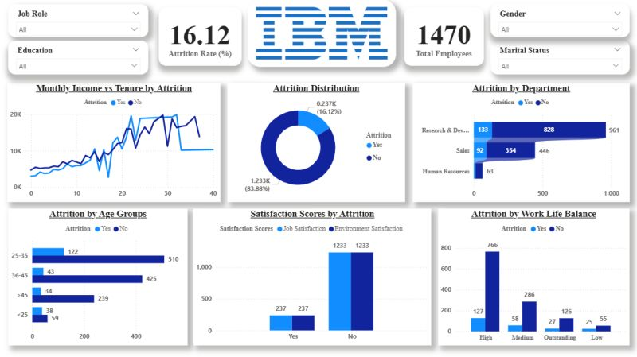
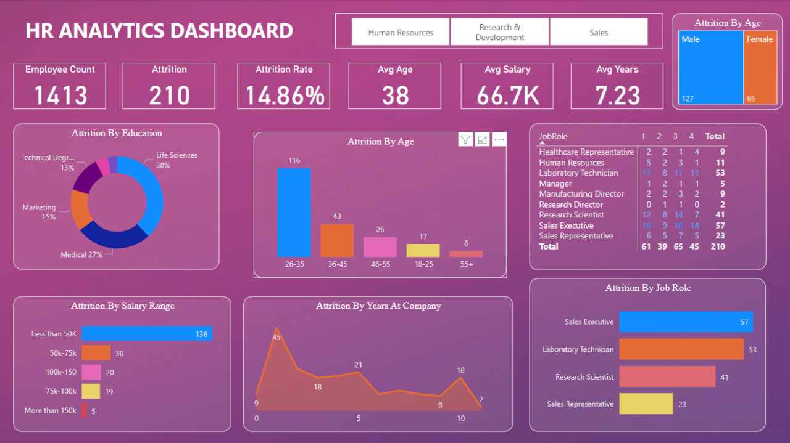

# HR Analytics & Employee Attrition Dashboard

## 📌 Project Overview
This project analyzes HR data to understand employee attrition patterns and workforce trends using SQL and Power BI with AI-enabled analytics.

## 🧾 Dataset
- Source: IBM HR Analytics Employee Attrition Dataset (Kaggle – Public Dataset)
- Type: Workforce and performance data

## 🔄 Data Cleaning & Transformation
- Converted attrition into a binary flag (Yes/No)
- Standardized department and job role values
- Validated salary and age ranges
- Created age groups and salary bands
- Removed invalid and incomplete records

## 🛠 Tools & Technologies
- Excel – Data cleaning and transformation
- SQL – Workforce analysis
- Power BI – Interactive dashboards
- AI Tools – NLP-based Q&A and pattern detection

## 📊 Key KPIs
- Total Employees
- Attrition Rate (%)
- Average Salary
- Average Performance Rating
- Department-wise Attrition

## 📊 Dashboard Output

## 🤖 AI Usage
- Power BI Q&A for natural language queries
- AI visuals for attrition pattern detection
- ChatGPT used for insight interpretation

## ✅ Key Outcomes
- Identified high-attrition departments
- Revealed salary and performance patterns
- Enabled proactive HR decision-making
